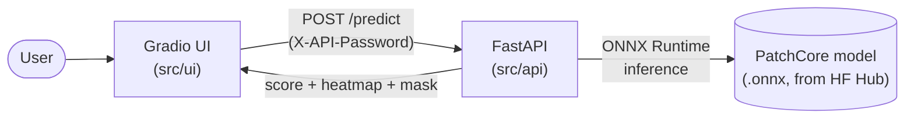

# screwit

Anomaly detection for screws: train a PatchCore model with
[anomalib](https://github.com/open-edge-platform/anomalib), export it to ONNX, and
serve it behind a FastAPI endpoint with a Gradio UI on top — upload a photo, get
back a score and a defect heatmap.


## Architecture



The API loads the PatchCore ONNX model from Hugging Face Hub once at startup
(`src/api/app.py`'s lifespan) and keeps it in memory; the UI is a thin client that
just forwards uploads to the API and renders the response.

## Layout

- `notebooks/` — training (anomalib, PatchCore), logged to W&B
- `src/api/` — FastAPI inference service, loads the ONNX model from HF Hub
- `src/ui/` — Gradio dashboard: upload image, view score + mask
- `src/shared/` — config and request/response models shared by `api` and `ui`
- `docker/` — one Dockerfile per service (`api`, `gradio`)
- `terraform/` — Cloud Run deployment
- `get_data.sh` — downloads MVTec AD categories into `data/`

## Quickstart

```bash
uv sync --all-groups
cp .env.example .env   # fill in HF_API_KEY etc.

./get_data.sh                                  # default: screw
run notebooks/train.ipynb       # train + export a model

uv run uvicorn src.api.app:app --reload        # API on :8000
uv run python src/ui/app.py                    # UI on :7860
```

## Eval

Single training run per model (see `notebooks/train.ipynb`, hyperparameters in
`configs/<model_name>.yaml`), tracked in W&B:

| Model       | Epochs | Image AUROC | Image F1 | Pixel AUROC | Pixel F1 |
|-------------|-------:|-------------:|---------:|-------------:|---------:|
| PatchCore   |      5 |       0.9874 |   0.9639 |       0.8521 |   0.6181 |
| PaDiM       |      1 |       0.8437 |   0.8421 |       0.9716 |   0.1637 |
| EfficientAd |     15 |       0.8373 |   0.8489 |       0.9665 |   0.3912 |

PatchCore leads on image-level detection by a wide margin; PaDiM/EfficientAd
localize pixels better (higher pixel AUROC) but lag well behind on pixel F1.
Not hyperparameter-tuned — see `configs/` to adjust and re-run.

## Deployment

GCP Cloud Run, via Terraform (`terraform/`), auto-applied by
`.github/workflows/deploy.yml` on every push to `main`: build+push the
backend/frontend images to Artifact Registry, then `terraform apply` the
`fastapi-backend` and `gradio-frontend` Cloud Run services.

Terraform is split into two separate configs with separate state, on purpose:

- **`terraform/`** — the Cloud Run services. Meant to run in CI on every push
  to `main`, authenticated as the `github-actions-deployer` service account.
- **`terraform/bootstrap/`** — the Artifact Registry repo, the
  `github-actions-deployer` service account itself, and its IAM grants.
  Applied manually, rarely, by a human with privileged GCP access, never by
  CI: `github-actions-deployer` is deliberately scoped to Cloud Run deploy
  rights only, so a leaked `GCP_CREDENTIALS` secret can't grant itself
  broader project access. If those resources lived in the CI-managed config,
  every CI-driven `terraform apply` would try to reconcile IAM/registry
  settings and fail with a permissions error.

One-time manual setup (not automated, and shouldn't be — see
`terraform/bootstrap/main.tf`'s comments for why the CI identity deliberately
can't do this itself):

1. Create a GCS bucket for Terraform state (Terraform/GCS can't create its
   own backend bucket):
   ```bash
   gcloud storage buckets create gs://<bucket-name> --location=europe-west1
   ```
2. Apply the bootstrap config manually, with your own privileged credentials
   (`gcloud auth application-default login`) — uses its own state prefix
   (`screwit-bootstrap`, vs. `screwit` for the root config, same bucket):
   ```bash
   cd terraform/bootstrap
   terraform init -backend-config="bucket=<bucket-name>" -backend-config="prefix=screwit-bootstrap"
   terraform apply -var project_id=<gcp-project-id> -var state_bucket_name=<bucket-name>
   ```
   Creates the Artifact Registry repo, the `github-actions-deployer` service
   account, and grants it `roles/storage.objectAdmin` on the state bucket
   (needed for the deploy workflow's own `terraform init`/`apply` against
   that bucket).
3. Get the service account's JSON key:
   ```bash
   terraform output -raw ci_deployer_key | base64 -d
   ```
4. Set these as GitHub Actions secrets: `GCP_PROJECT_ID`, `GCP_CREDENTIALS`
   (the key from step 3), `TF_STATE_BUCKET` (the bucket from step 1),
   `HF_API_KEY`, `HF_MODEL_REPO_ID`, `APP_PASSWORD`.

Without step 4's `TF_STATE_BUCKET` secret, `terraform init` in the deploy
workflow fails immediately (empty backend config).

## Roadmap

Done
- Evals (image/pixel AUROC, F1) across PatchCore/PaDiM/EfficientAd — see Eval above
- Real deployment (Cloud Run via Terraform, `deploy.yml`)

Training
- Configs, experiment tracking, hyperparameter tuning
- Retraining pipeline with human-in-the-loop

API / UI
- Configurable model/category choice (currently hardcoded to PatchCore + screw)
- Blob storage for uploaded images

Ops
- Tests (currently just health + predict smoke tests)

Later / exploratory
- Edge export (run on small devices)
- VLM experiment

Resources
- [MVTec AD dataset](https://www.mvtec.com/research-teaching/datasets/mvtec-ad)
- General anomaly detection methods (GAN-, VAE-based, ...)
